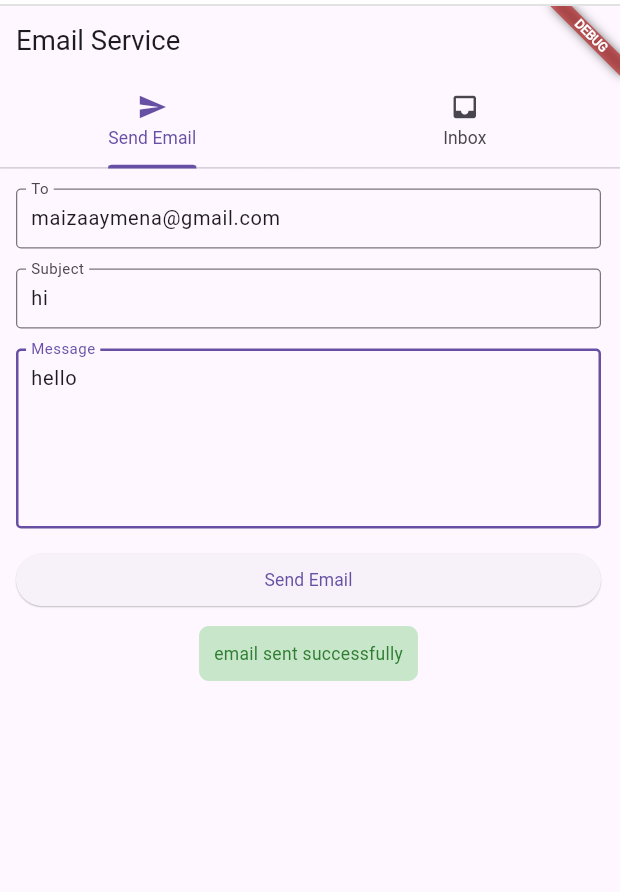

# 📧 Inboxo - Email Management API

A powerful and intuitive FastAPI-based email management system that allows you to send, receive, and manage Gmail emails through a RESTful API interface.
 


## 🌟 Features

- ✉️ **Send Emails**: Send emails programmatically through Gmail SMTP
- 📥 **Fetch Emails**: Retrieve the latest 5 emails from your Gmail inbox
- 🗑️ **Delete Emails**: Remove unwanted emails from your inbox
- 🔒 **Secure Authentication**: Uses Gmail App Passwords for secure access
- 🌐 **CORS Enabled**: Ready for web application integration
- 🚀 **Fast & Async**: Built with FastAPI for high performance
- 📖 **Auto Documentation**: Interactive API docs with Swagger UI

## 🛠️ Tech Stack

- **Backend**: FastAPI
- **Server**: Uvicorn
- **Email Protocol**: SMTP & IMAP
- **Data Validation**: Pydantic
- **Language**: Python 3.13+

## 📋 Prerequisites

Before you begin, ensure you have:

- Python 3.13 or higher installed
- A Gmail account with App Password enabled
- Git (for cloning the repository)

### Setting up Gmail App Password

1. Go to your [Google Account settings](https://myaccount.google.com/)
2. Navigate to Security → 2-Step Verification
3. At the bottom, click on "App passwords"
4. Generate a new app password for "Mail"
5. Use this password in your configuration

## 🚀 Quick Start

### 1. Clone the Repository

```bash
git clone https://github.com/MaizaAymen/Inboxo.git
cd Inboxo
```

### 2. Create Virtual Environment

```bash
python -m venv .venv
.venv\Scripts\activate  # On Windows
# source .venv/bin/activate  # On macOS/Linux
```

### 3. Install Dependencies

```bash
pip install -r requirements.txt
```

### 4. Configure Email Credentials

Edit the `main.py` file and update your email credentials:

```python
email_address = "your-email@gmail.com"
password = "your-app-password"  # Use Gmail App Password, not regular password
```

### 5. Run the Application

```bash
python -m uvicorn main:app --reload
```

The API will be available at `http://localhost:8000`

## 📚 API Documentation

Once the server is running, you can access:

- **Interactive API Docs**: `http://localhost:8000/docs`
- **ReDoc Documentation**: `http://localhost:8000/redoc`

## 🔗 API Endpoints

### Root Endpoint
- **GET** `/` - Welcome message

### Email Operations
- **GET** `/emails` - Fetch latest 5 emails from inbox
- **POST** `/sendemail` - Send a new email
- **DELETE** `/deleteemail` - Delete specific emails

### Example API Usage

#### Send an Email
```bash
curl -X POST "http://localhost:8000/sendemail" \
     -H "Content-Type: application/json" \
     -d '{
       "to": "recipient@example.com",
       "subject": "Test Email",
       "body": "This is a test email from Inboxo API!"
     }'
```

#### Get Emails
```bash
curl -X GET "http://localhost:8000/emails"
```

## 📊 Request/Response Examples

### Send Email Request
```json
{
  "to": "recipient@example.com",
  "subject": "Hello from Inboxo!",
  "body": "This is a test message sent via the Inboxo API."
}
```

### Send Email Response
```json
{
  "message": "email sent successfully"
}
```

### Get Emails Response
```json
{
  "emails": [
    {
      "from": "sender@example.com",
      "subject": "Meeting Tomorrow",
      "body": "Don't forget about our meeting tomorrow at 2 PM."
    }
  ]
}
```

## 🔧 Configuration

### Environment Variables (Recommended)

For production use, consider using environment variables:

```python
import os
from dotenv import load_dotenv

load_dotenv()

email_address = os.getenv("EMAIL_ADDRESS")
password = os.getenv("EMAIL_PASSWORD")
```

Create a `.env` file:
```
EMAIL_ADDRESS=your-email@gmail.com
EMAIL_PASSWORD=your-app-password
```

## 🛡️ Security Considerations

- ⚠️ **Never commit credentials** to version control
- 🔐 Use Gmail App Passwords instead of regular passwords
- 🌐 Consider implementing authentication for production use
- 🔒 Use environment variables for sensitive data
- 🚧 Implement rate limiting for production deployments

## 🤝 Contributing

Contributions are welcome! Please feel free to submit a Pull Request. For major changes, please open an issue first to discuss what you would like to change.

1. Fork the project
2. Create your feature branch (`git checkout -b feature/AmazingFeature`)
3. Commit your changes (`git commit -m 'Add some AmazingFeature'`)
4. Push to the branch (`git push origin feature/AmazingFeature`)
5. Open a Pull Request

## 📝 License

This project is licensed under the MIT License - see the [LICENSE](LICENSE) file for details.

## 👨‍💻 Author

**Aymen Maiza**
- GitHub: [@MaizaAymen](https://github.com/MaizaAymen)

## 🚀 Future Enhancements

- [ ] Email templates support
- [ ] Attachment handling
- [ ] Email filtering and search
- [ ] Multiple email account support
- [ ] Email scheduling
- [ ] Database integration for email storage
- [ ] User authentication and authorization
- [ ] Email analytics and reporting

## 📞 Support

If you have any questions or run into issues, please feel free to:
- Open an issue on GitHub
- Contact the author

---

**⭐ If you found this project helpful, please give it a star!**